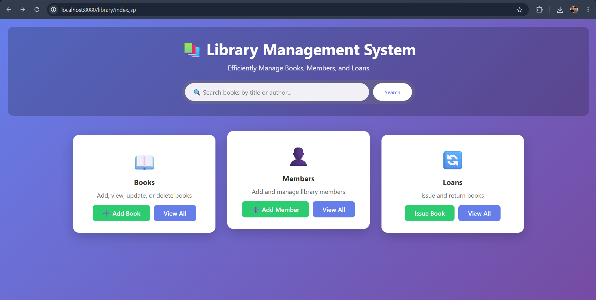
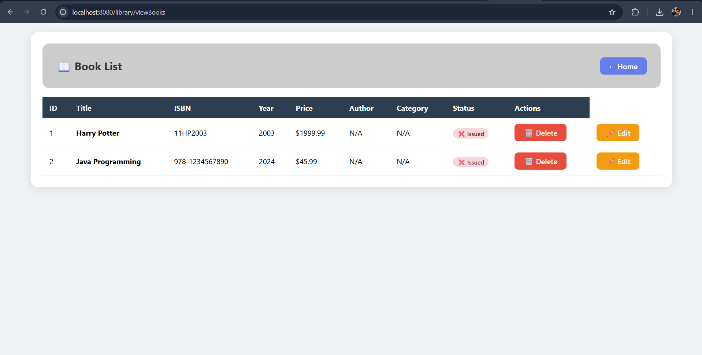
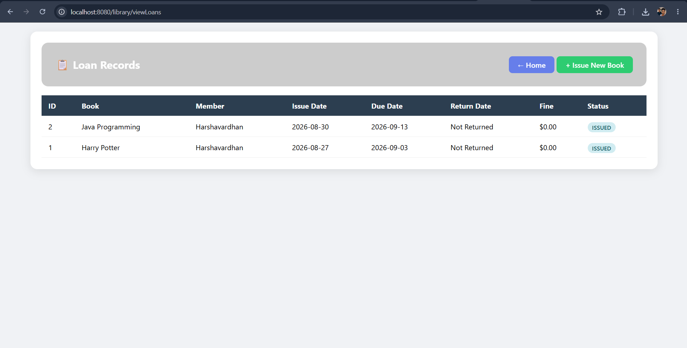
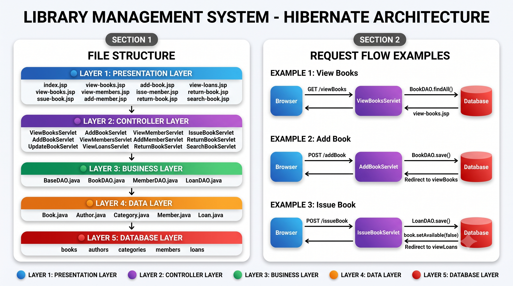

# 📚 Library Management System

A web-based **Library Management System** built using **Java, Hibernate, Servlets, JSP, and PostgreSQL**. The application provides functionality for managing books, members, and book transactions through a structured backend architecture.

---

## 📸 Screenshots

### Homepage & Book Management

| Homepage                              | Book List                               |
| ------------------------------------- | --------------------------------------- |
|  |  |

### Book Transactions & Search

| Issue Book                                | Search Results                            |
| ----------------------------------------- | ----------------------------------------- |
|  |  |

---

## ✨ Features

* ✅ Add, view, update, and delete books
* ✅ Add and view library members
* ✅ Issue and return books
* ✅ Search books by title or author
* ✅ PostgreSQL database integration
* ✅ Hibernate-based database interaction
* ✅ Servlet-based request handling
* ✅ JSP-based user interface
* ✅ Structured layered architecture

---

## 🛠️ Tech Stack

### Frontend

* JSP (Java Server Pages)
* HTML5
* CSS3
* JavaScript

### Backend

* Java
* Servlets
* Hibernate ORM

### Database

* PostgreSQL

### Build & Development Tools

* Maven
* Apache Tomcat
* Eclipse IDE
* Git & GitHub

---

## 🏗️ Architecture

The application follows a layered architecture where HTTP requests are handled by Servlets, business/database operations are separated into appropriate layers, and Hibernate manages persistence with PostgreSQL.



### Application Flow

```text
Client / Browser
       │
       ▼
   JSP Pages
       │
       ▼
    Servlets
       │
       ▼
      DAO
       │
       ▼
   Hibernate
       │
       ▼
  PostgreSQL
```

---

## 📊 Database Structure

The application uses PostgreSQL as the relational database.

### Main Tables

```text
books
├── id
├── title
├── isbn
├── year
├── price
├── author_id
├── category_id
└── available

authors
├── id
├── name
└── biography

categories
├── id
├── name
└── description

members
├── id
├── name
├── email
├── phone
└── active

loans
├── id
├── book_id
├── member_id
├── issue_date
├── due_date
├── return_date
├── fine
└── status
```

---

## 📁 Project Structure

```text
library-management-system/
│
├── src/
│   └── main/
│       ├── java/
│       │   └── com/
│       │       └── library/
│       │           └── library_management_system/
│       │               ├── entity/
│       │               │   └── Entity classes
│       │               │
│       │               ├── dao/
│       │               │   └── Data access classes
│       │               │
│       │               └── servlet/
│       │                   └── Servlet controllers
│       │
│       ├── resources/
│       │   └── META-INF/
│       │       └── persistence.xml
│       │
│       └── webapp/
│           ├── css/
│           ├── JSP/
│           └── WEB-INF/
│               └── web.xml
│
├── screenshots/
│   ├── homepage.png
│   ├── book-list.png
│   ├── issue-book.png
│   ├── search.png
│   └── architecture.png
│
├── pom.xml
└── README.md
```

---

## 🔧 Setup Instructions

### Prerequisites

Make sure the following are installed:

* Java JDK
* Maven
* PostgreSQL
* Apache Tomcat
* Eclipse IDE

### 1. Clone the Repository

```bash
git clone https://github.com/Harshavardhan3535/library-management-system.git
cd library-management-system
```

### 2. Create the Database

Create a PostgreSQL database:

```sql
CREATE DATABASE library_db;
```

### 3. Configure Database

Update the database configuration in the project's Hibernate configuration file with your local PostgreSQL credentials.

Example:

```text
Database: library_db
Username: postgres
Password: your_password
Host: localhost
Port: 5432
```

> Do not commit real database passwords or other credentials to GitHub.

### 4. Build the Project

```bash
mvn clean package
```

This generates the WAR file inside the `target/` directory.

### 5. Deploy to Tomcat

Copy the generated WAR file into the Tomcat `webapps` directory.

```text
target/library.war
        ↓
Tomcat/webapps/
```

### 6. Start Tomcat

On Windows:

```bash
startup.bat
```

### 7. Open the Application

Open the application in your browser using the deployed context path.

```text
http://localhost:8080/library/
```

---

## 🔄 CRUD Operations

### Create

Add new books or members to the system.

### Read

Retrieve individual records or display available records.

### Update

Modify existing book or member information.

### Delete

Remove records from the database.

---

## 📚 Core Concepts Covered

* Java Web Application Development
* Servlets
* JSP
* Hibernate ORM
* PostgreSQL
* Maven
* DAO Pattern
* Entity Layer
* Layered Architecture
* CRUD Operations
* Database Connectivity
* HTTP Request/Response Handling
* Tomcat Deployment

---

## 🎯 Learning Outcomes

Through this project, I gained practical experience in:

* Building Java-based web applications
* Handling HTTP requests using Servlets
* Creating dynamic web pages using JSP
* Connecting Java applications with PostgreSQL
* Working with Hibernate ORM
* Separating database operations using the DAO pattern
* Structuring a web application using layered architecture
* Building and packaging applications using Maven
* Deploying Java web applications on Apache Tomcat

---

## 🚀 Future Improvements

* Add user authentication and authorization
* Add role-based access for librarians and members
* Improve search and filtering
* Add pagination for large datasets
* Add proper form validation
* Add transaction management
* Improve UI responsiveness
* Add automated testing
* Migrate the backend to Spring Boot and Spring Data JPA

---

## 🤝 Contributing

This project was created as a learning project. Suggestions and improvements are welcome through issues or pull requests.

---

## 📝 License

This project is available for educational and learning purposes.

---

## 👤 Author

**Harsha Vardhan**

* GitHub: [@Harshavardhan3535](https://github.com/Harshavardhan3535)

---

## ⭐ Show Your Support

If you found this project useful or interesting, consider giving the repository a ⭐ on GitHub.
